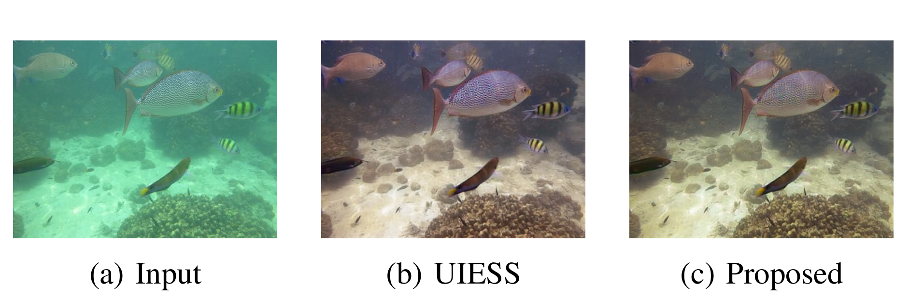
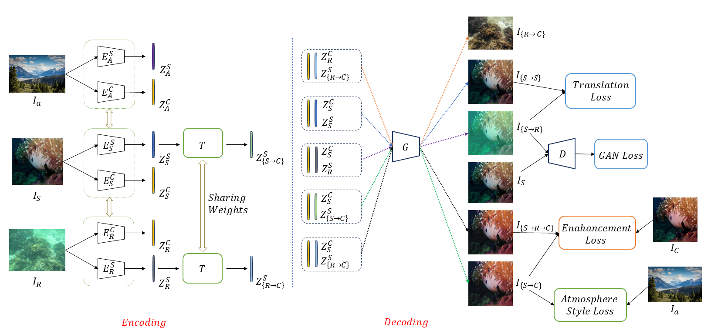

# Atmosphere-Guided Domain Adaptation for Underwater Image Enhancement

> **Minor Project | DAIICT, Gandhinagar**  
> Dhaval Panchal · Prof. Srimanta Mandal  
> Department of Information and Communication Technology

---

## What's the problem?

Underwater images are a mess. Color shifts toward blue-green, contrast tanks, and fine details vanish — all because water absorbs and scatters light differently at different wavelengths. Deep learning models trained on synthetic data *look* great on benchmarks, then fall apart the moment you throw real ocean footage at them. This is the domain shift problem, and it's stubborn.

UIESS (Chen & Pei, 2022) tackled it cleverly: separate each image into a *content* part (structure, edges — domain-invariant) and a *style* part (color, texture — domain-specific), then train a latent transform that nudges underwater style toward clean style. Smart. But it learns style alignment in a purely relative sense — it knows synthetic and real should look similar, but never gets told what "clean" actually looks like.

**This work fixes that.**

---

## The core idea

We bring in a third domain: clear, in-air (atmospheric) images. These act as an explicit anchor for what clean style *should* be in latent space. Instead of hoping the model figures out "clean" by triangulation, we hand it a concrete reference and add a loss that pulls transformed underwater styles toward it.

One extra encoder. One new loss term. The original UIESS architecture stays intact.

<p align="center">
  
  <br>
  <em>Input → UIESS → Ours (proposed). The atmosphere-guided approach recovers more natural colors with fewer artifacts.</em>
</p>

---

## How it works

Images are disentangled into:
- **Content** `Z_C` — extracted by a shared encoder with instance normalization (strips style, keeps structure)
- **Style** `Z_S` — extracted by domain-specific encoders (no IN, preserves appearance statistics)

A lightweight MLP **Latent Transform Unit** `T` maps degraded underwater style to a clean style manifold:

```
Z_S→C = T(Z_S)     # for both synthetic and real inputs
```

The generator then recombines content + transformed style via AdaIN to produce the enhanced image.

**New in this work:** an Atmosphere Style Encoder `E_A` computes a clean style reference `Z_A` from in-air images. The atmosphere-guided loss:

```
L_atm = || Z_S→C − Z_A ||_1
```

turns relative style alignment into absolute style alignment. Training is more stable, color correction is more accurate.

<p align="center">
  
  <br>
  <em>Framework overview. Atmosphere encoder added on top of the original UIESS pipeline.</em>
</p>

---

## Results

### Quantitative

| Method | PSNR ↑ | SSIM ↑ | UCIQE (SQUID) ↑ |
|---|---|---|---|
| Pretrained UIESS | 20.87 | 0.8184 | 0.3067 |
| **Ours** | **21.08** | 0.8046 | **0.3342** |

PSNR improves on synthetic data. UCIQE (a no-reference perceptual metric) improves substantially on the harder SQUID real-world dataset — where it matters most.

### Speed

- **UIEB dataset:** 13.3 ms/image → ~75 FPS  
- **EUVP dataset:** 15.2 ms/image → ~65 FPS  
- **Model size:** 4.26M parameters  

Real-time capable on standard-resolution images.

### Generalization: dehazing without retraining

The framework was evaluated on real hazy atmospheric images against Dark Channel Prior (DCP). Despite never being trained for dehazing, our model produced cleaner output with better color — suggesting the latent space captures general degradation patterns, not just underwater-specific ones.

---

## Controllable Enhancement

Because enhancement lives in latent space, you can interpolate:

```
Z_controlled = Z_S + α * (Z_S→C − Z_S)
```

- `α = 0` → original input
- `α = 1` → full enhancement
- `α > 1` → oversaturated (useful for seeing the model's limits)
- `α < 0` → further degraded

Smooth, continuous control over enhancement strength at inference time — no retraining needed.

---

## Datasets

| Role | Dataset | Size |
|---|---|---|
| Synthetic training | EUVP | 3,700 train / 515 test pairs |
| Real-world adaptation | UIEB | 600 train / 290 val |
| Real-world test | SQUID | 17 images |
| Atmosphere (clean style) | DIV2K | 400 images |

---

## Getting Started

### Requirements

```
torch==1.5.1
torchvision==0.6.1
matplotlib==3.2.2
pillow==8.0.1
seaborn==0.10.1
scikit-learn==1.0
```

### Dataset structure

```
UIESS/
├── data/
│   ├── trainA/          # real-world underwater images
│   ├── trainB/          # synthetic underwater images
│   ├── trainB_label/    # synthetic clean references
│   ├── trainC/          # atmospheric clean images  ← new
│   ├── testA/
│   ├── testB/
│   └── testB_label/
```

Download: [UIEB](https://li-chongyi.github.io/proj_benchmark.html) · [EUVP](http://irvlab.cs.umn.edu/resources/euvp-dataset) · [DIV2K](https://data.vision.ee.ethz.ch/cvl/DIV2K/) · [SQUID](https://zenodo.org/records/5744037)

### Training

**Standard (original UIESS):**
```bash
python train.py --data_root /path/to/dataset --gpu 0
```

**Atmosphere-guided (this work):**  
Use `version3.ipynb` in the `UIESS-master/` directory. Run cells sequentially — it handles per-epoch validation and saves the best model automatically.

Atmosphere loss kicks in after a 3-epoch warmup (`λ_atm = 0.5`) to let latents stabilize first.

### Testing
```bash
python test.py --test_dir /path/to/images --out_dir /path/to/output --gpu 0
```

---

## Loss Functions (summary)

| Loss | Purpose |
|---|---|
| `L_cyc` | Cycle consistency — prevents information loss across domains |
| `L_self` | Self-reconstruction — content preservation within domain |
| `L_GAN` | Adversarial — perceptual realism |
| `L_pixel` (L1) | Pixel fidelity to ground truth |
| `L_ssim` | Structural similarity — edges and texture |
| `L_per` | VGG perceptual — high-level semantic consistency |
| `L_tv` | Total variation — spatial smoothness |
| `L_latent` | Latent consistency — aligns synthetic/real transformed styles |
| **`L_atm`** | **Atmosphere-guided — absolute clean style supervision (new)** |

Total: `L = L_tran + L_en + λ_atm · L_atm`

---

## Code & Citation

Code: [github.com/DhavalPanchal252/Atmosphere-Guided-UIESS](https://github.com/DhavalPanchal252/Atmosphere-Guided-UIESS)

This work builds on UIESS by Chen & Pei (IEEE Access, 2022):
```bibtex
@ARTICLE{9866748,
  author={Chen, Yu-Wei and Pei, Soo-Chang},
  journal={IEEE Access},
  title={Domain Adaptation for Underwater Image Enhancement via Content and Style Separation},
  year={2022},
  volume={10},
  pages={90523-90534},
  doi={10.1109/ACCESS.2022.3201555}
}
```

Base code references: [PyTorch-GAN](https://github.com/eriklindernoren/PyTorch-GAN) · [DLN](https://github.com/WangLiwen1994/DLN)

---

*Feel free to open an issue for bugs or questions.*